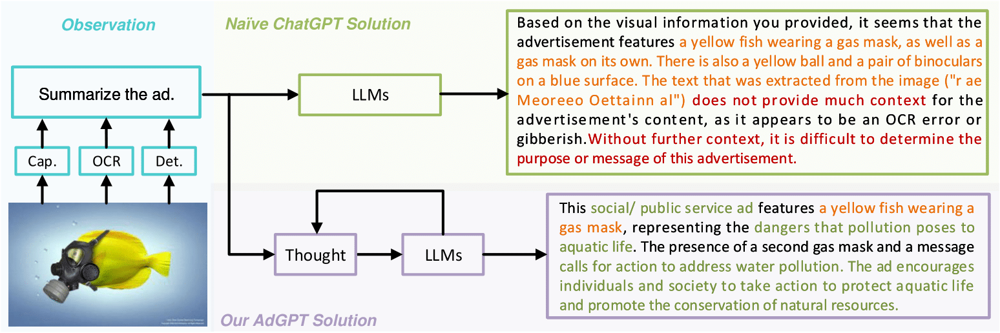
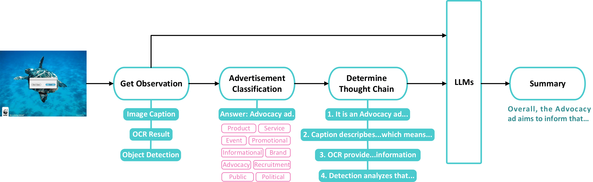
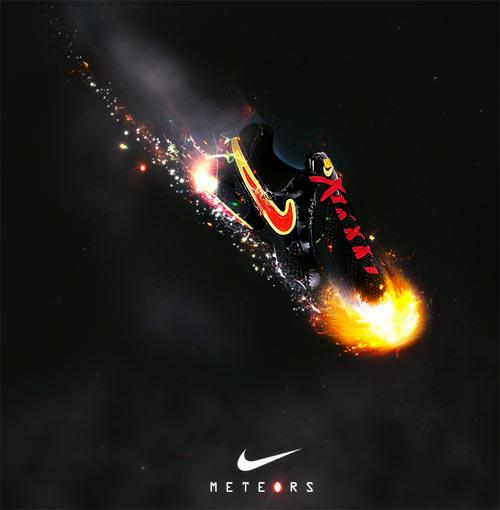
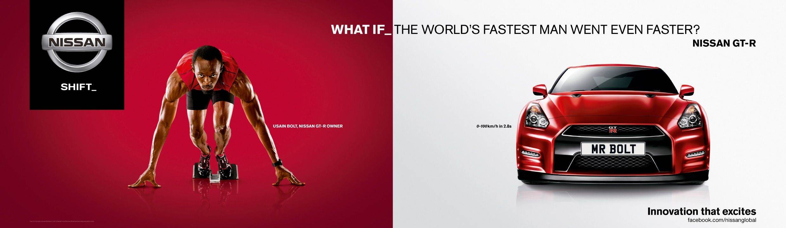
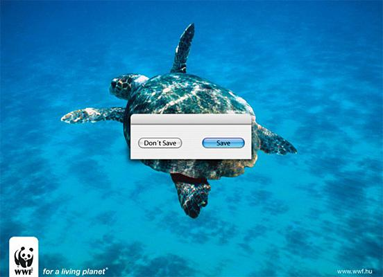
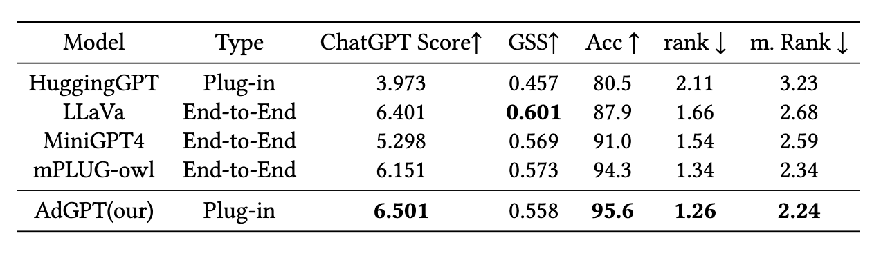

# [TOMM] AdGPT: Explore Meaningful Advertising with ChatGPT

Official repo for AdGPT: Explore Meaningful Advertising with ChatGPT



## Method



## Environment Setup

```
conda create -n AdGPT python=3.9
conda activate AdGPT

pip install -r requirements.txt

pip install torch==1.13.1+cu116 torchvision==0.14.1+cu116 --extra-index-url https://download.pytorch.org/whl/cu116

python -m pip install 'git+https://github.com/facebookresearch/detectron2.git'
```

## Inferrence

### AdGPT

**Openai series**
```
CUDA_VISIBLE_DEVICES=0 python demo.py --image_path ./img/test.jpg \
               --openai \
               --openai_key YOUR_API_KEY \
               --openai_base https://api.openai.com/v1 \
               --chat_model gpt-4o-mini
```

**GLM series**
```

CUDA_VISIBLE_DEVICES=0 python exp.py --image_path img/book.jpg \
               --chatglm \
               --glm_key YOUR_API_KEY \
               --glm_model glm-4-flash \
               --version cn \
```

Check [OpenAI](https://platform.openai.com/playground/chat) and [GLM](https://open.bigmodel.cn/dev/howuse/introduction) documents for how to get your own API.
<!-- 
if you have more than one device

```
 python demo.py --image_path ./img/test.jpg \
                                      --openai_key YOUR_API_KEY \
                                      --openai_base https://api.openai.com/v1 \
                                      --chat_model gpt-4-turbo-preview
``` -->

#### Example

| Image                      | Summary                                                                                                                                                                                                                                                                                                                                                                                                                                                                                                                                                                                                                                                                            |
| -------------------------- | ---------------------------------------------------------------------------------------------------------------------------------------------------------------------------------------------------------------------------------------------------------------------------------------------------------------------------------------------------------------------------------------------------------------------------------------------------------------------------------------------------------------------------------------------------------------------------------------------------------------------------------------------------------------------------------- |
|    | This advertisement features a pair of high-performance shoes, distinguished by a visually striking fire trail that symbolizes exceptional speed and agility. Targeted at athletes and fitness enthusiasts, the ad suggests that these shoes can significantly enhance athletic performance. While specific promotional offers or a clear call to action are not detailed in the provided analysis, the imagery alone strongly encourages potential buyers to explore and possibly purchase the shoes to unlock their peak performance capabilities. The ad's emotional and visual appeal lies in its promise of speed, making it memorable and engaging for its intended audience. |
|   | This Nissan GT-R advertisement capitalizes on themes of speed and celebrity endorsement to position the sports car as a symbol of performance and luxury. By highlighting its rapid acceleration and associating the vehicle with Usain Bolt, the "world's fastest man," the ad targets sports car enthusiasts and those who aspire to the pinnacle of automotive achievement. The inclusion of a socially engaging element through a Facebook link, along with the imagery used, aims to create an aspirational image for the Nissan GT-R, inviting the audience to envision themselves at the pinnacle of success and performance.                                               |
|  | This advertisement from the WWF leverages the image of a turtle in the ocean, accompanied by a digital "Save" button, to highlight the urgent need for environmental conservation, particularly marine life protection. By creating an emotional appeal through wildlife imagery and presenting a clear call to action, the ad encourages viewers to contribute to saving the planet, either through donations or engagement in conservation efforts. The use of the "Don't Save" versus "Save" buttons cleverly emphasizes the impact of individual choices, urging immediate action to support the cause and make a positive difference for living creatures and their habitats. |

## Benchmarks & Metrics

### Generative Similarity Score

```
python test.py --GSS
```



## TODO

- [ ] Metrics-ChatGPT Rating
- [ ] Downstream Task-Slogan Generation
- [ ] Chinese Version AdGPT

## Acknowledgement

We would like to express our gratitude to previous work, which includes but is not limited to: [Diffusers](https://github.com/huggingface/diffusers), [EasyOCR](https://github.com/JaidedAI/EasyOCR), [Detic](https://github.com/facebookresearch/Detic), [Transformers](https://github.com/huggingface/transformers), [CNOCR](https://github.com/breezedeus/cnocr) and [detectron2](https://github.com/facebookresearch/detectron2).
